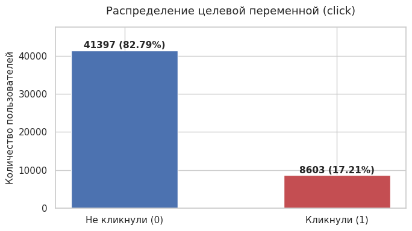
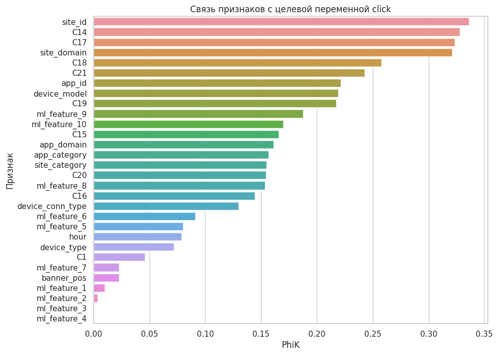
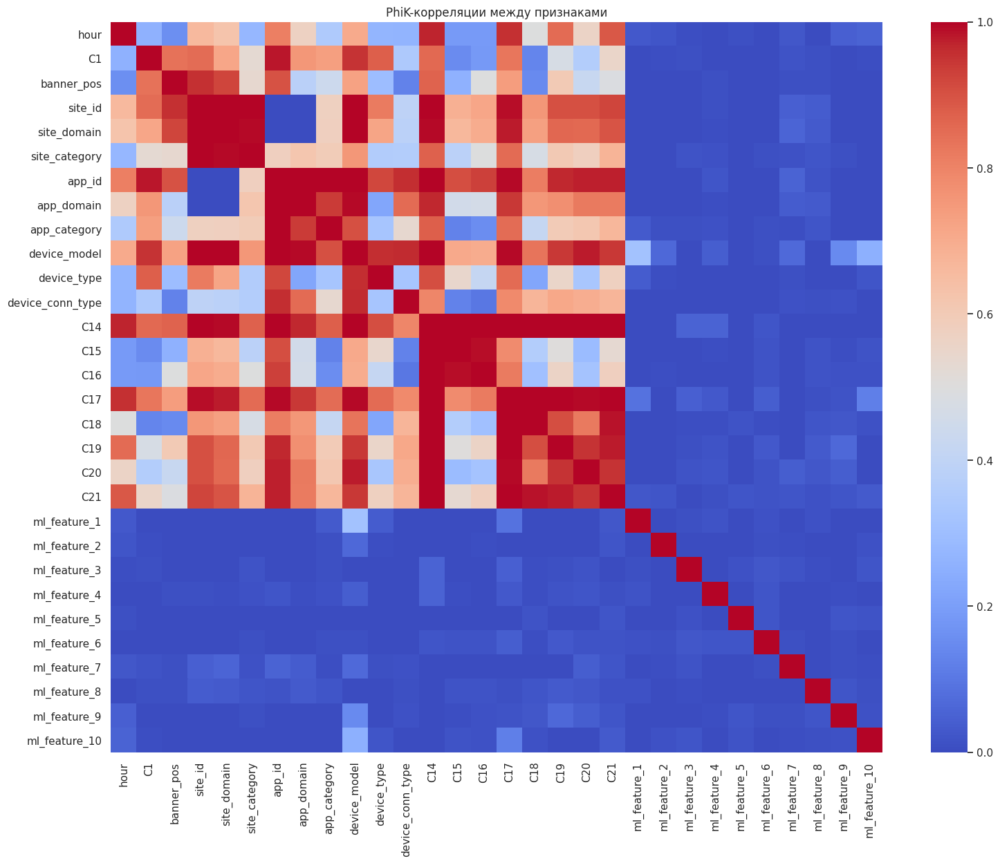
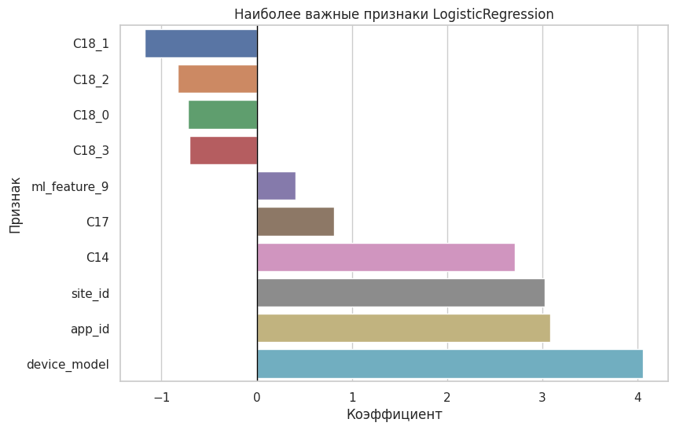
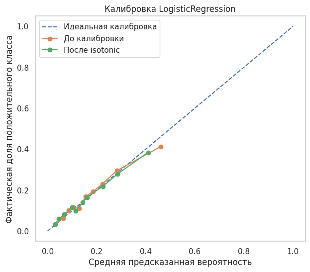
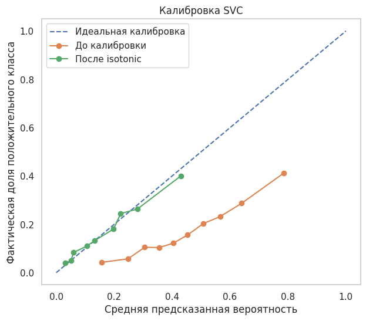

# Advandex: прогнозирование вероятности клика по рекламе

Проект по построению модели бинарной классификации для прогнозирования вероятности клика пользователя по рекламному объявлению (**CTR prediction**).

Модель предназначена для использования в рекламном аукционе, где предсказанная вероятность клика участвует в оценке ожидаемой эффективности показа. Поэтому в проекте важно не только правильно ранжировать объявления по вероятности клика, но и получать **хорошо откалиброванные вероятностные прогнозы**.

## Цель проекта

Разработать интерпретируемую модель машинного обучения, которая по характеристикам рекламного показа определяет вероятность клика пользователя.

Основные требования:

* качество выше простого baseline;
* корректная работа с несбалансированной целевой переменной;
* оценка качества именно вероятностного прогноза;
* калибровка предсказанных вероятностей;
* интерпретируемость модели;
* подготовка итогового pipeline и артефактов для последующего использования.

В качестве основной метрики качества использовалась **PR-AUC**, поскольку положительный класс представлен значительно реже отрицательного.

Для оценки качества вероятностей дополнительно использовались:

* Brier Score;
* Log Loss;
* Expected Calibration Error (ECE);
* Maximum Calibration Error (MCE).

## Бизнес-контекст

Модель может использоваться в рекламных аукционах в режиме реального времени.

Предсказанный CTR участвует в расчёте ожидаемой ценности рекламного показа:

```text
Expected value = Bid × Predicted CTR
```

Поэтому ошибка в оценке вероятности клика может непосредственно влиять на выбор победителя рекламного аукциона.

В отличие от обычной задачи бинарной классификации, здесь важно не только определить класс `0/1`, но и получить вероятность, максимально соответствующую фактической частоте кликов.

## Данные

Датасет содержит **50 000 наблюдений** и **34 признака**.

Каждая строка соответствует одному показу рекламного объявления.

Целевая переменная:

* `click = 1` - пользователь кликнул по объявлению;
* `click = 0` - пользователь не совершил клик.

Положительный класс составляет только:

**17,21% наблюдений**

что указывает на заметный дисбаланс классов.

### Группы признаков

Данные содержат несколько типов характеристик.

**Рекламная площадка:**

* `site_id`;
* `site_domain`;
* `site_category`.

**Рекламируемое приложение:**

* `app_id`;
* `app_domain`;
* `app_category`.

**Устройство пользователя:**

* `device_id`;
* `device_ip`;
* `device_model`;
* `device_type`;
* `device_conn_type`.

**Характеристики рекламного показа и аукциона:**

* `banner_pos`;
* `C1`;
* `C14`–`C21`.

**Предварительно сгенерированные признаки:**

* `ml_feature_1`-`ml_feature_10`.

Часть признаков анонимизирована, поэтому их предметная интерпретация ограничена.

Данные охватывают несколько дней октября 2014 года.

## Используемые технологии

**Язык и работа с данными:**

* Python
* pandas
* NumPy

**Машинное обучение:**

* scikit-learn
* LogisticRegression
* SVC
* DummyClassifier
* GridSearchCV
* RFECV
* SequentialFeatureSelector
* VarianceThreshold
* TargetEncoder
* OneHotEncoder
* StandardScaler

**Анализ данных:**

* PhiK
* SciPy

**Визуализация:**

* Matplotlib
* Seaborn

**Работа с артефактами:**

* Joblib
* JSON
* pathlib

**Среда:**

* Jupyter Notebook

## Этапы проекта

### 1. Исследовательский анализ данных

На этапе EDA были изучены:

* структура датасета;
* распределение целевой переменной;
* числовые и категориальные признаки;
* кардинальность категорий;
* выбросы и особенности распределений;
* потенциально бесполезные идентификаторы;
* взаимосвязи между признаками;
* связь признаков с целевой переменной.

Для анализа смешанных числовых и категориальных признаков использовался коэффициент **PhiK**.

Наиболее заметную связь с `click` показали:

* `site_id`;
* `C14`;
* `C17`;
* `site_domain`;
* `C18`;
* `C21`;
* `app_id`;
* `device_model`;
* `C19`;
* `ml_feature_9`.

Уникальный идентификатор записи `id`, а также `device_id` и `device_ip` были исключены из дальнейшего моделирования из-за низкой практической ценности и риска переобучения.

## 2. Разделение данных

Данные были разделены на обучающую и тестовую выборки в соотношении:

* **40 000 наблюдений - train;**
* **10 000 наблюдений - test.**

Использовалось стратифицированное разделение, благодаря чему доля положительного класса сохранилась примерно на уровне **17,2%** в обеих выборках.

## 3. Pipeline предобработки

Для воспроизводимой подготовки данных был построен единый `Pipeline` на основе `ColumnTransformer`.

### Числовые признаки

Для числовых признаков использовались:

* заполнение пропусков медианой;
* `StandardScaler`.

### Низкокардинальные категории

Для категориальных признаков с небольшим количеством значений использовались:

* заполнение наиболее частым значением;
* `OneHotEncoder`.

### Высококардинальные категории

Для признаков с большим количеством уникальных значений применялся:

* `TargetEncoder`.

Такой подход позволил поместить всю предобработку внутрь ML-pipeline и одинаково применять её при обучении и инференсе.

## 4. Отбор признаков

Отбор выполнялся в несколько этапов.

Сначала были выбраны наиболее перспективные признаки на основе результатов EDA и PhiK.

Затем использовались:

* `VarianceThreshold`;
* `RFECV`;
* `SequentialFeatureSelector`.

После отбора в итоговый набор вошли:

```text
ml_feature_9
C18
site_id
app_id
device_model
C17
C19
C21
C14
```

После кодирования категориального `C18` итоговое пространство модели содержит **12 признаков**.

## 5. Baseline

В качестве базовой модели использовался `DummyClassifier`.

Его результат:

**PR-AUC ≈ 0.172**

что практически соответствует доле положительного класса.

Дополнительно были обучены базовые модели:

| Модель             | CV PR-AUC |
| ------------------ | --------: |
| DummyClassifier    |     0.172 |
| LogisticRegression | **0.367** |
| Linear SVC         |     0.330 |

Уже базовая `LogisticRegression` существенно превзошла DummyClassifier.

## 6. Подбор гиперпараметров

Для моделей `LogisticRegression` и `SVC` был выполнен `GridSearchCV` с пятифолдовой кросс-валидацией.

### LogisticRegression

Лучшие параметры:

```text
C = 0.1
penalty = l2
solver = liblinear
class_weight = None
```

Результат на кросс-валидации:

**PR-AUC = 0.3737**

### SVC

Лучшие параметры:

```text
C = 0.01
class_weight = balanced
kernel = linear
```

Результат на кросс-валидации:

**PR-AUC = 0.3714**

Модели показали близкое качество, однако LogisticRegression немного превзошла SVC по основной метрике.

## 7. Результаты на тестовой выборке

| Модель             |     PR-AUC |      Brier | Precision |     Recall |         F1 |
| ------------------ | ---------: | ---------: | --------: | ---------: | ---------: |
| LogisticRegression | **0.3486** | **0.1299** |    0.5314 |     0.0936 |     0.1591 |
| SVC                |     0.3473 |     0.2103 |    0.2931 | **0.6363** | **0.4013** |

`LogisticRegression` показала немного более высокую PR-AUC и значительно лучший Brier Score.

`SVC` имеет более высокий Recall и F1 при стандартном пороге, однако основная задача проекта заключается в оценке вероятности клика, а не только в бинарном решении.

Снижение PR-AUC относительно кросс-валидации составило примерно:

* LogisticRegression: **−0.025**;
* SVC: **−0.024**.

Резкого расхождения между CV и тестовой выборкой не наблюдается.

## Интерпретация модели

Поскольку итоговая `LogisticRegression` является линейной моделью, её коэффициенты можно использовать для анализа относительной важности признаков.

Наибольшие по модулю коэффициенты получили:

| Признак        | Коэффициент |
| -------------- | ----------: |
| `device_model` |       4.059 |
| `app_id`       |       3.079 |
| `site_id`      |       3.028 |
| `C14`          |       2.711 |
| `C18_1`        |      −1.174 |

Таким образом, наиболее заметную роль в рамках построенной модели играют характеристики:

* устройства пользователя;
* рекламируемого приложения;
* площадки показа;
* контекста рекламного аукциона.

Однако из-за анонимизации части данных содержательная интерпретация отдельных признаков ограничена.

## Калибровка вероятностей

Отдельный этап проекта был посвящён анализу того, насколько предсказанные вероятности соответствуют фактической частоте кликов.

Для этого использовались:

* calibration curves;
* Brier Score;
* ECE;
* MCE.

### LogisticRegression

До дополнительной калибровки:

| Метрика |   Значение |
| ------- | ---------: |
| Brier   | **0.1302** |
| ECE     | **0.0111** |
| MCE     |     0.1635 |

Вероятности модели изначально оказались достаточно хорошо откалиброванными.

После isotonic calibration:

| Метрика | Значение |
| ------- | -------: |
| Brier   |   0.1302 |
| ECE     |   0.0096 |
| MCE     |   0.2529 |

Дополнительная калибровка практически не улучшила Brier Score, немного уменьшила ECE, но ухудшила MCE и PR-AUC.

Поэтому дополнительная калибровка LogisticRegression в финальном решении не использовалась.

### SVC

До isotonic calibration:

| Метрика | Значение |
| ------- | -------: |
| Brier   |   0.2090 |
| ECE     |   0.2701 |
| MCE     |   0.3948 |

После калибровки:

| Метрика |   Значение |
| ------- | ---------: |
| Brier   | **0.1305** |
| ECE     | **0.0094** |
| MCE     | **0.1377** |

Калибровка значительно улучшила вероятностные прогнозы SVC.

При этом PR-AUC после isotonic calibration снизился примерно до **0.330**, поэтому с учётом основной метрики проекта SVC не была выбрана в качестве основной production-модели.

## Сравнение итоговых решений

| Модель                        |     PR-AUC |      Brier |        ECE |        MCE |
| ----------------------------- | ---------: | ---------: | ---------: | ---------: |
| DummyClassifier               |     0.1721 |     0.1425 |     0.0001 |     0.0001 |
| **LogisticRegression**        | **0.3486** | **0.1299** |     0.0120 |     0.1461 |
| SVC + sigmoid                 |     0.3473 |     0.2103 |     0.2721 |     0.4133 |
| LogisticRegression + isotonic |     0.3302 |     0.1302 |     0.0096 |     0.2529 |
| SVC + isotonic                |     0.3302 |     0.1305 | **0.0094** | **0.1377** |

Основной моделью была выбрана **LogisticRegression без дополнительной калибровки**.

Она обеспечивает лучший баланс между:

* PR-AUC;
* качеством вероятностного прогноза;
* интерпретируемостью;
* простотой использования;
* скоростью инференса.

## Подготовка модели к использованию

Финальное решение собрано в единый `Pipeline`:

```text
Raw data
   ↓
ColumnTransformer
   ├── Numeric → Imputer → StandardScaler
   ├── Low-cardinality categorical → Imputer → OneHotEncoder
   └── High-cardinality categorical → Imputer → TargetEncoder
   ↓
LogisticRegression
   ↓
Predicted CTR
```
Дополнительно сохранена откалиброванная версия SVC для сравнения вероятностных прогнозов.

После сохранения и повторной загрузки артефактов была проведена проверка идентичности предсказаний.

## Визуализации

### Распределение целевой переменной



### Связь признаков с целевой переменной по PhiK



### PhiK-корреляции между признаками



### Важность признаков LogisticRegression



### Калибровочная кривая LogisticRegression



### Калибровка SVC



## Итог

В рамках проекта была разработана модель прогнозирования вероятности клика пользователя по рекламному объявлению.

Основной baseline на основе `DummyClassifier` показал:

**PR-AUC ≈ 0.172**

После анализа данных, отбора признаков, построения pipeline и подбора гиперпараметров итоговая `LogisticRegression` достигла:

**PR-AUC = 0.3486**

на отложенной тестовой выборке.

При этом модель показала хорошее качество калибровки:

**Brier Score ≈ 0.130**

**ECE ≈ 0.012**

Дополнительная isotonic-калибровка оказалась полезной для SVC, но практически не улучшила LogisticRegression и ухудшила её PR-AUC.

В результате именно `LogisticRegression` была выбрана в качестве основной production-модели благодаря сочетанию качества ранжирования, калибровки, интерпретируемости и относительной простоты.

## Возможные улучшения

Текущий результат можно рассматривать как ML-прототип.

Для дальнейшего развития проекта можно:

* увеличить объём обучающей выборки;
* использовать более длительный временной период;
* провести временную валидацию вместо случайного train/test split;
* расширить feature engineering;
* исследовать нелинейные модели;
* проверить устойчивость модели к изменению распределения данных;
* настроить мониторинг PR-AUC и калибровки после внедрения.

Особенно важна временная валидация, поскольку реальный рекламный сервис должен предсказывать клики для будущих показов на основе исторических данных.

